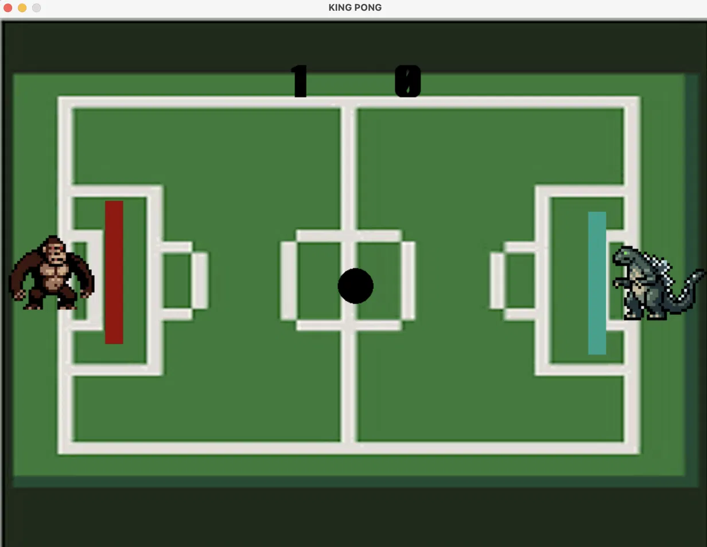

# King Pong

Un Pong à deux joueurs sur le même clavier, écrit en Python avec pygame. Le premier à 5 points gagne!



Mon premier projet de code perso, écrit en 2019 :)

Hésitez pas à télécharger pygame pour le tester!!

Musique par Sandro Cattalano

## Lancer le jeu

Il faut Python 3.13. Lancez le jeu depuis son dossier, car les images et les sons sont chargés par chemin relatif.

Avec [uv](https://docs.astral.sh/uv/) :

```sh
uv run king_pong.py
```

Avec pip :

```sh
python3.13 -m venv .venv
source .venv/bin/activate
pip install pygame
python king_pong.py
```

## Contrôles

| Joueur | Monter | Descendre |
| ------ | ------ | --------- |
| Droite | ↑      | ↓         |
| Gauche | Z      | S         |

Appuyez sur **Espace** pour lancer la balle.